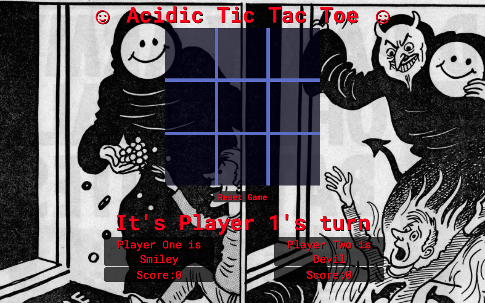

# Acidic Tic Tac Toe#

Acidic Tic Tac Toe is a web based game of tic tac toe built in javascript
with an acid house theme.
It was built for my first GA project.

## Game Link
[Acidic Tic Tac Toe](https://hluscombe.github.io/project0/)

## Major Features
* Autoplaying acid music
* Fun board icons
* it's tic tac toe, baby!

## Screenshot

## Languages

This project was written with JavaScript & jQuery

## List Of Any Known Bugs

* Sometimes the boxes of the table collapse on reset
* Occasionally double clicks will cause icons to switch

## Wishlist/Future features

* change from alert style notice of winner to a dynamically created HTML element
